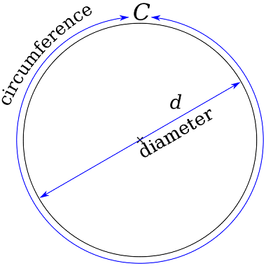

# Introduction

This project will show you how to calculate the value of π using the OctaPi distributed Raspberry Pi computer. You can complete part of this project with only a single Raspberry Pi or other computer running Python 3. The last part of the project requires an OctaPi (see the [Build an OctaPi]() resource.)

| How      | I          | Wish  | I    | Could   | Calculate | Pi |
| ---------|------------| ------|------|---------|-----------|----|
| 3        | 1          | 4     |1     |5        |9          |2   |

The number π is the ratio of a circle's circumference to its diameter, 3.14159... It has been represented by the Greek letter "π" (pronounced "pi") since the mid-18th century.

The value of π commonly occurs in mathematics, physics and engineering problems but is an **irrational number** and therefore its actual value is hard to use in calculations that are accurate.

Finding the value of π is both important for science and engineering, but has also something of an intellectual puzzle that has entertained mathematicians for centuries.
