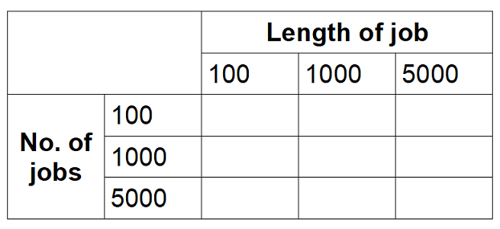

## Challenge: evaluate the dartboard method

The code you have written passes a random seed to each job, so the entropy on the client is distributed for use on the servers. This means it's possible to implement better entropy on the client in order to improve the accuracy of the computation. For now, we can make best use of the entropy that we have by finding the best combination of job length and number of jobs.

+ Run the dartboard program lots of times with different combinations of job number and job length, and record the value of π obtained in a table like this:

What was the best combination of job length and number of jobs?

**Why does the accuracy seem to improve for some combinations of number of jobs and job length compared to others?**

--- collapse ---
---
title: Answer
---

The entropy will be only be useful for a finite number of **trials in each job**: after a while the trials start to correlate as the supposedly random points begin to repeat in the same places on the square, forming a pattern. When this happens, increasing the length of the job will not improve the accuracy of the result. Likewise, the entropy will only be useful for a limited number of **jobs**: the client entropy will be exhausted after a while and the jobs it launches will also start to correlate. When this happens, running more jobs won’t improve the accuracy of the answer.

**The accuracy of results calculated by a Monte Carlo technique using pseudorandom numbers will always be limited by the amount of entropy available.**

--- /collapse ---

### Challenge

- Try some "Pi philology": find a sentence (such as _How I wish I could calculate Pi_) in which the number of letters of each word corresponds to the digits of π in the right order.
- Use your OctaPi to investigate the power of distributed computing! Why not learn about [Public Key Cryptography](https://projects.raspberrypi.org/en/projects/rpi-python-octapi-public-key-cryptography){:target="_blank"}?
- For more about the value of π, read: _Pi Unleashed_ by Jörg Arndt and Christoph Haenel, Springer-Verlag, 2006, ISBN 978-3-540-66572-4. English translation by Catriona and David Lischka
