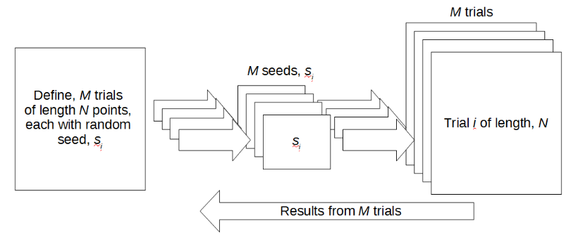
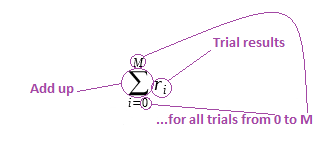

# Step seven - Implementing the 'dartboard' algorithm on a distributed system

Your standalone program demonstrates that the function for running jobs containing many random trials is working correctly. We will now use it to develop a distributed version for running on OctaPi servers from an OctaPi client.

  

  _Crown Copyright 2017_

### Implementing on a distributed system

In this implementation, we have M trials of N points so that the total number of points in the calculation of π is N x M.

The calculation uses M random seeds, s, one for each trial. The result of each trial, ri, is the number of points that were inside the circle for trial, i. The overall result, R, is therefore the sum of all the individual trial results, r<sub>i</sub>, divided by the total number of points in the square N x M. Here's how it can be written as a mathematical formula.

  

This might look a bit scary, so let's break down what this means. This site has a [good explanation of sigma](https://www.mathsisfun.com/algebra/sigma-notation.html) (the Σ symbol), which means to sum up whatever is after it.

  

 This formula represents the steps you did when writing the dartboard program in the previous programming challenge:
 - Include inputs for the user to define how many points are tested in each trial (n) and the number of trials (m)
 - Call the function you wrote m times, generating a new random seed for each time you call the function
 - Add up the total values found 'inside' the circle

Now let's add back in the rest of the equation:

  

Adding the rest of the formula back in adds the final part of the programming challenge:
 - Then calculate π = (4 * total_inside) / (n * m).

We have described it this way because this method allows us to break down a large number of trials into jobs that can, in theory, be run on many processors in parallel.

### Adapting the code

Assuming that you are **starting with the standalone Python 3 code from the previous challenge**, you will need to adapt it to work with Dispy on OctaPi using the above arrangement.

- Create a copy of your standalone code and save it with a different file name

- Start by adding code to your original Python script to create a Dispy cluster on your OctaPi network to run your 'compute' function. Add this code at the start of your file.

    ```python
    import dispy

    server_nodes ='192.168.1.\*'
    cluster = dispy.JobCluster(compute, nodes=server_nodes)
    ```

    This client code creates a cluster object using your 'compute' function and points to servers on your network with the the addresses specified.

- You now need a loop in order to create jobs. This loop will distribute the `compute` function with a random seed, `ran_seed`, to be run on the cluster `no_of_jobs` times. Your code for doing this might look like this:

    ```python
    jobs = []
    for i in range(no_of_jobs):
        # Schedule the execution of the 'compute' function on one of the OctaPi nodes
        ran_seed = random.randint(0,65535) # Define a random seed for this job

        # Create a job
        job = cluster.submit(ran_seed, no_of_points)
        job.id = i # associate an ID to the job

        # Add this job to the list of jobs
        jobs.append(job)
    ```

- Finally, you need to collect the results from the jobs after they have completed and calculate the total number of points that were inside the quarter circle.

    ```python
    total_inside = 0
    for job in jobs:
        ran_seed, inside = job() # waits for job to finish and returns results

        total_inside += inside
    ```

- The value of Pi is given as

    ```python
    total_no_of_points = no_of_points * no_of_jobs
    Pi = (4.0 * total_inside) / total_no_of_points
    ```

### Programming challenge
Write a distributed Python 3 program to re-implement the standalone version of the 'dartboard' algorithm using Dispy for running on OctaPi. You can use the code fragments you have been shown.

--- collapse ---
---
title: Answer
---

Our version of this code is as shown [here](resources/compute_pi_canonical.py).

--- /collapse ---

This code works well for moderately sized computations, but the client machine can run out of memory as each job that is running requires storage space on the client. There is a technique to drip-feed jobs to the cluster shown in the Dispy documentation. A version of the same code using this more efficient method can be found [here](resources/compute_pi_efficient.py).
